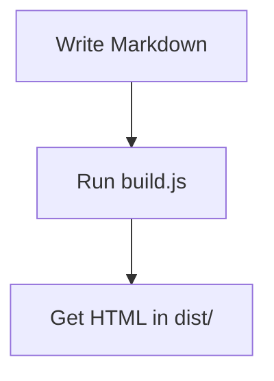

# Example Site

## Introduction

Welcome to this example site built with a simple Markdown-to-HTML builder.

## Features

- Converts Markdown to HTML
- Auto-generates a Table of Contents
- Supports syntax-highlighted code blocks
- Supports [Mermaid](https://mermaid.js.org/) diagrams
- Copies images and videos to `dist/`

## Code Example

```js
console.log("Hello, world!");
```

## Diagram Example



## Table Example

| Name  | Type   | Description          |
|-------|--------|----------------------|
| input | string | Path to markdown file |
| output | string | Path to output HTML  |

## Blockquote

> This site was generated from a single Markdown file.
